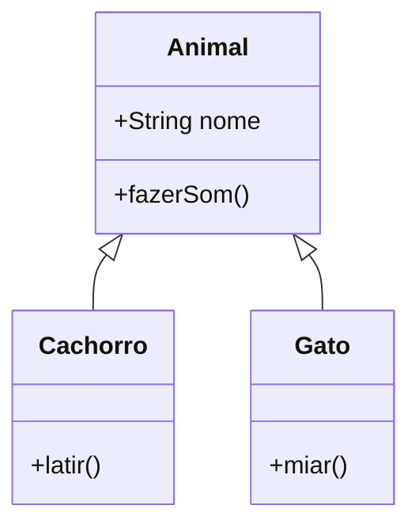
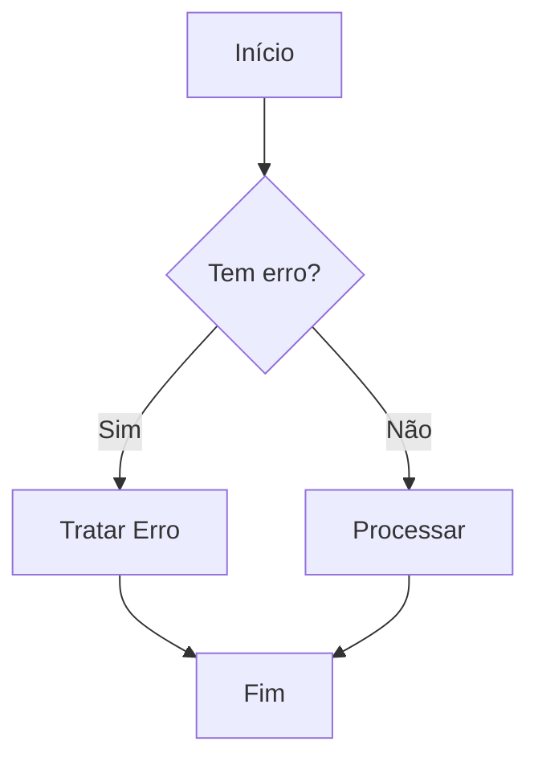

# Recursos Visuais

Esta página demonstra o uso de recursos visuais avançados na documentação.

## 1. Terminal Animado (Termynal)

Podemos simular a execução de comandos no terminal para ensinar processos como compilação ou execução de scripts.

```termynal-to-html
$ python script.py
Consultando banco de dados...
Processando dados...
[SUCCESS] Dados processados com sucesso!
```

Outro exemplo:

```termynal-to-html
$ pip install fastapi
Downloading fastapi-0.68.1-py3-none-any.whl (52 kB)
Installing collected packages: fastapi
Successfully installed fastapi-0.68.1
```

## 2. Diagramas (Mermaid.js)

Podemos usar diagramas para explicar conceitos complexos como herança de classes.

### Exemplo de Herança



### Exemplo de Fluxo


