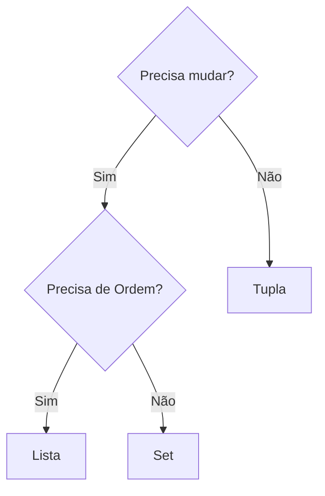

# Aula 07 - Tuplas e Sets

## 🎯 Objetivos da Aula

- [ ] Entender o que são Tuplas (`tuple`) e sua imutabilidade
- [ ] Conhecer o Desempacotamento de Tuplas
- [ ] Entender o que são Sets (`set`) e sua unicidade
- [ ] Realizar operações de conjuntos (União, Interseção, Diferença)
- [ ] Saber quando usar Listas, Tuplas ou Sets

---

## 📚 Conteúdo

### 1. Tuplas (Tuples)

Tuplas são muito parecidas com listas, mas são **imutáveis**. Uma vez criadas, não podemos adicionar, remover ou alterar itens.
Usamos parênteses `()` para criar.

```python
# Lista (Mutável)
lista = [1, 2, 3]
lista[0] = 10 # OK

# Tupla (Imutável)
tupla = (1, 2, 3)
# tupla[0] = 10 # ERRO! TypeError
```

**Para que servem?**
- Dados que não devem mudar (ex: coordenadas GPS, dias da semana).
- São mais leves e rápidas na memória que listas.

### 2. Desempacotamento de Tuplas

Podemos atribuir os valores de uma tupla a várias variáveis de uma vez.

```python
coordenadas = (10, 20)
x, y = coordenadas

print(x) # 10
print(y) # 20
```

### 3. Sets (Conjuntos)

Sets são coleções **não ordenadas** de elementos **únicos**.
Usamos chaves `{}`.

```python
# Criando um set
frutas = {"Maçã", "Banana", "Maçã", "Uva"}

print(frutas)
# Saída: {'Banana', 'Maçã', 'Uva'} 
# Note que "Maçã" apareceu só uma vez!
```

> **Não tem índice:** Como não é ordenado, não podemos fazer `frutas[0]`.

### 4. Operações com Sets

Sets brilham na matemática dos conjuntos.

- **União (`|`)**: Junta tudo (sem repetir).
- **Interseção (`&`)**: Só o que tem nos dois.
- **Diferença (`-`)**: O que tem em um mas não no outro.

```python
A = {1, 2, 3, 4}
B = {3, 4, 5, 6}

print(A | B) # {1, 2, 3, 4, 5, 6} -> União
print(A & B) # {3, 4} -> Interseção
print(A - B) # {1, 2} -> Diferença (O que tem só em A)
```

### 5. Quando usar o quê?



| Estrutura | Ordenada? | Mutável? | Duplicatas? | Sintaxe | Uso Ideal |
| :--- | :---: | :---: | :---: | :---: | :--- |
| **Lista** | Sim | Sim | Sim | `[]` | Coleções gerais, pilhas, filas. |
| **Tupla** | Sim | Não | Sim | `()` | Dados fixos, configurações. |
| **Set** | Não | Sim | Não | `{}` | Garantir unicidade, operações matemáticas. |

---

## 💻 Em Prática

Vamos usar um Set para remover itens duplicados de uma lista de convidados bagunçada.

```python
# limpando_lista.py

# Lista com nomes repetidos
convidados_lista = ["Ana", "Carlos", "Ana", "Beto", "Carlos", "Dani"]

print(f"Lista original: {convidados_lista}")

# Converte para set (remove duplicatas automaticamente)
convidados_set = set(convidados_lista)

print(f"Set limpo: {convidados_set}")

# Voltando para lista (se precisar ordenar, por exemplo)
convidados_unicos = list(convidados_set)
convidados_unicos.sort()

print(f"Lista final ordenada: {convidados_unicos}")
```

---

## 📝 Resumo

- **Tuplas `()`**: Imutáveis. Boas para dados constantes.
- **Sets `{}`**: Elementos únicos e não ordenados.
- **Desempacotamento**: `a, b = (1, 2)` facilita a vida.
- **Operações de Conjunto**: `|` (União), `&` (Interseção), `-` (Diferença).

---

## 🎯 Próximos Passos

<div class="grid cards" markdown>

-   :material-presentation: **Acessar Slides**
    -   [Ver Slides da Aula](slides/07-slides.html)

-   :material-school: **Quiz**
    -   [Responder Quiz](quizzes/quiz-07.md)

-   :material-dumbbell: **Exercícios**
    -   [Lista de Exercícios](exercicios/exercicios-07.md)

-   :material-rocket: **Projeto**
    -   [Mini Projeto](projetos/projeto-07.md)

</div>
