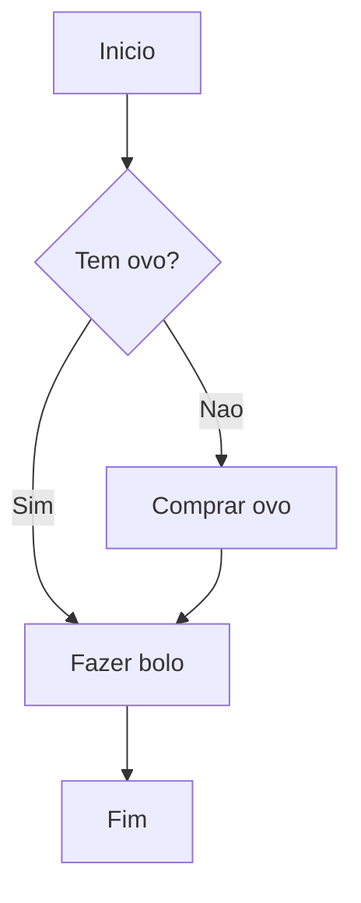

# Fundamentos da Computação

## Como Funciona um Computador?

Antes de programar, é importante entender onde seu código roda.

### Hardware vs Software
- **Hardware:** A parte física (CPU, Memória RAM, HD/SSD).
- **Software:** A parte lógica (Sistema Operacional, Programas, Scripts).

### O Papel do Sistema Operacional
O SO (Windows, Linux, macOS) gerencia o hardware e permite que programas sejam executados.

---

## Logica de Programação

Programar é dar ordens ao computador.

### Algoritmos
Um algoritmo é uma sequência de passos para resolver um problema.

Exemplo (Receita de Bolo):
1.  Pegar ingredientes.
2.  Misturar farinha e ovos.
3.  Colocar no forno.
4.  Esperar 40 min.
5.  Servir.

No código, é a mesma coisa!

